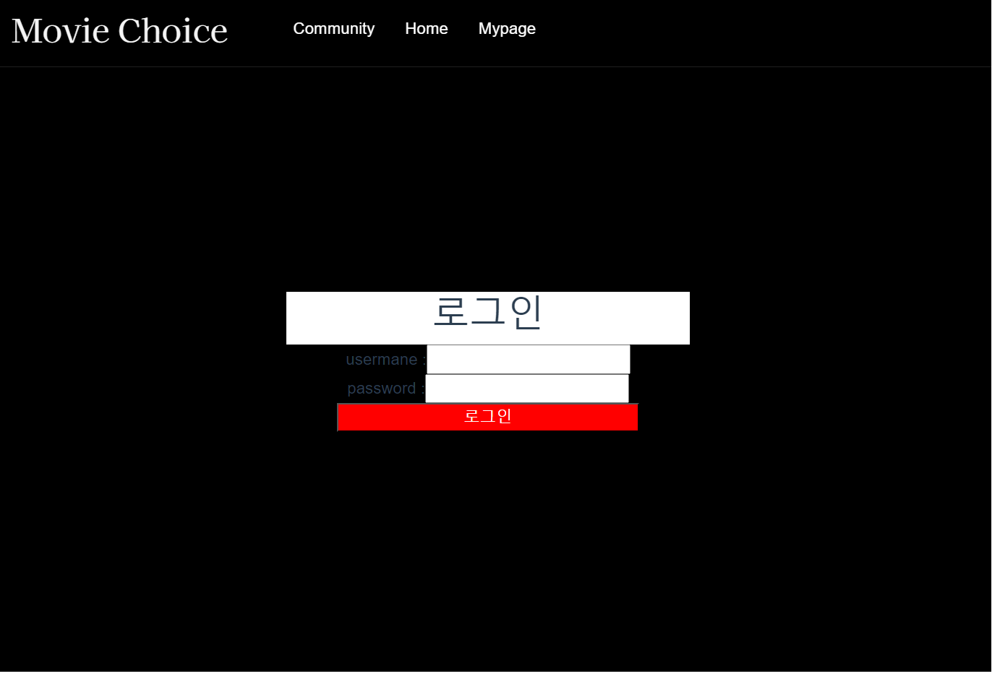
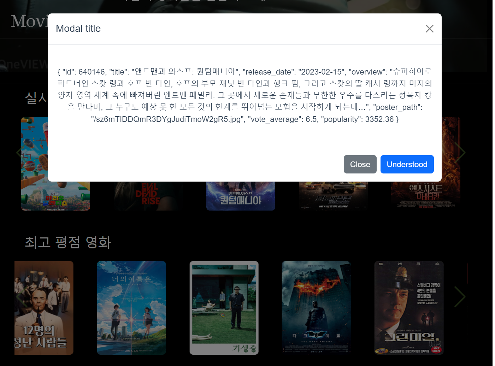

# env 작업
- Django에서의 모든 키를 .env파일에 보관
<br><br>
# TMDB DETAIL에서 영화 받아오기
- 300번까지 영화를 돌려 받아옴
```
class TotalMovies(models.Model):
    movie_id = models.IntegerField(primary_key=True, unique=True)
    title = models.CharField(max_length=100)
    release_date = models.DateField(blank=True)
    overview = models.TextField(blank=True)
    poster_path = models.TextField(blank=True)
    vote_average = models.FloatField(default=0)
    popularity = models.FloatField()
    genres = models.CharField(max_length=100, blank=True)
    runtime = models.CharField(max_length=50)
    video_id = models.CharField(max_length=500)
```
필요한 영화 정보를 모델에 적어서 테이블에 저장
get_popular_movies 와
get_top_rated_movies는 테이블에 저장하지 않고 실시간으로 받아오게 코드를 짰다
어제의 영화 받아오는 코드를 수정하며 
앞으로 사용할 모든 영화를 받아오게 되었다
<br><br>
## [주의할 점]
- git 의 사용에 있어서 
`pip install -r requirements.txt`로 파일을 받을 때 가상환경을 만들고 실행한 후에 해야 필요한 것만 받고 까지 받게 되어 충돌이 일어나게 된다 
<br><br>
# 로그인 페이지 작성

<br><br>
# Detail 패이지
- PopularListItem에서 모달을 실행
```
<a type="button" data-bs-toggle="modal" data-bs-target="#staticBackdrop">

</a>
```
-부모(PopularList)에서 데이터를 받은 후 다시 전달 
```
<PopularListItem :p_movie="p_movie" @movie-detail="getMovieDetail"></PopularListItem>

---------------------------------------------------------------------------
 methods:{
    getMovieDetail(input){
      this.MovieDetail = input
      this.$emit('Popualr-to-home',this.MovieDetail)
    }
  },
  ```
- HomeView에서 모달을 출력한다
