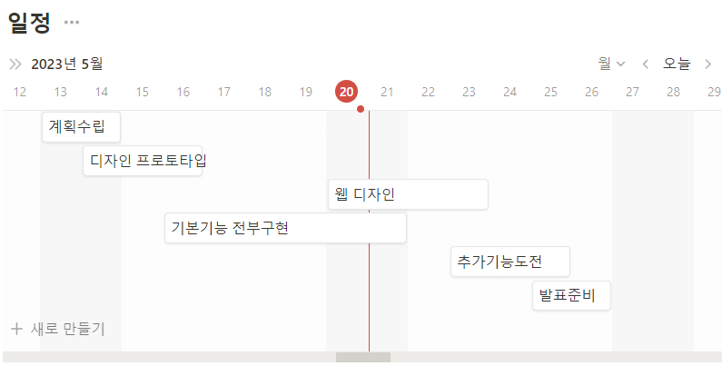
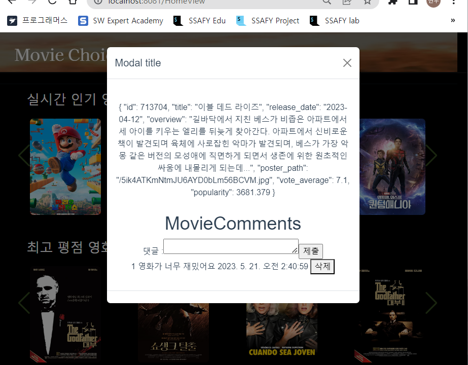
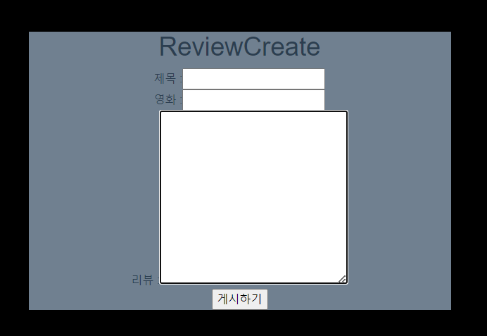
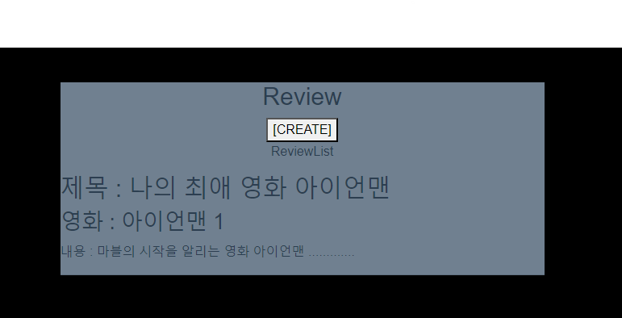

## ToDoList
1.각 영화의 간단리뷰 CRUD 제작

2.메인 리뷰글 CRUD 작성

## 1. 각 영화의 간단 리뷰구현
=> 각 영화의 detail페이지에서 한줄평을 유저들이 입력할 수 있도록 했다.

- 폼에 한줄 평 입력 시 바로 아래쪽에 한줄평이 나올 수 있도록 제작했다.
- 삭제 기능 또한 추가했다.
- 하지만 현재 server를 이용하지 않다보니 모든 영화에서 모든 한줄평이 나오기 때문에, Server에서 DB table을 제작하여 각각의 영화에 한줄평이 나오도록 수정해야한다.

## 2. 리뷰 제작 구현
### (1) 리뷰글을 만들 수 있는 폼 구현

### (2) 리뷰 리스트

- 유저들이 영화에 대한 리뷰를 작성할 수 있는 page를 제작

=> 현재는 UI보다 기능을 먼저 구현하는데 초점을 맞추고 있다.